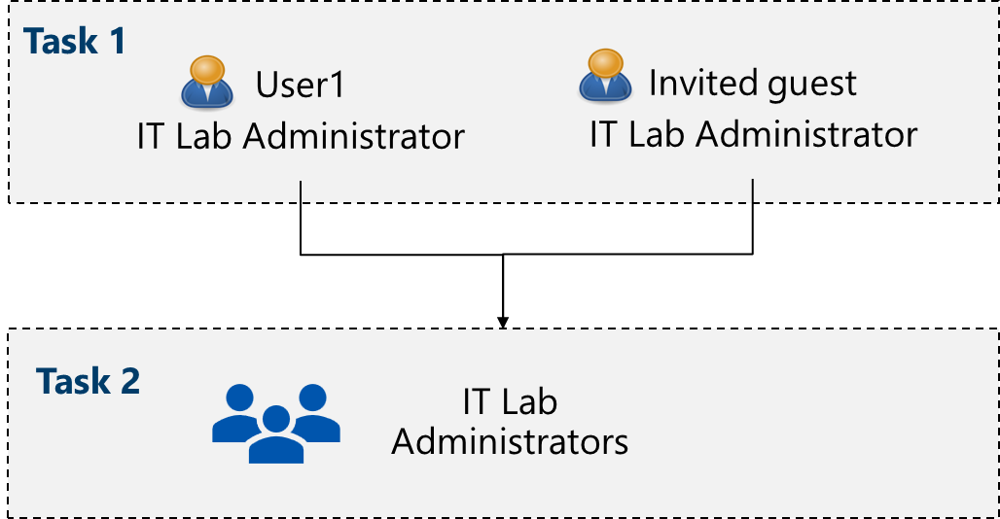

## Lab scenario

Your organization is building a new lab environment for pre-production testing of apps and services.  A few engineers are being hired to manage the lab environment, including the virtual machines. To allow the engineers to authenticate by using Microsoft Entra ID, you have been tasked with provisioning users and groups. To minimize administrative overhead, membership of the groups should be updated automatically based on job titles. 
## Architecture diagram

## Job skills

+ Task 1: Create and configure user accounts.
+ Task 2: Create groups and add members.

##### Task 1: Create and configure user accounts.
![[Pasted image 20260203130947.png]]
![[Pasted image 20260203131048.png]]

![[Pasted image 20260203131120.png]]
![[Pasted image 20260203132009.png]]
Invite External user
![[Pasted image 20260203132117.png]]![[Pasted image 20260203132153.png]]
![[Pasted image 20260203132300.png]]

##### Task 2: Create groups and add members.

![[Pasted image 20260203132553.png]]

![[Pasted image 20260203132900.png]]

![[Pasted image 20260203132941.png]]
![[Pasted image 20260203133008.png]]![[Pasted image 20260203133041.png]]